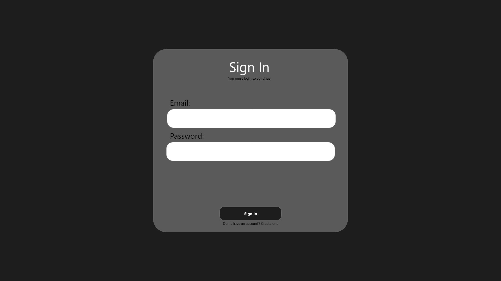
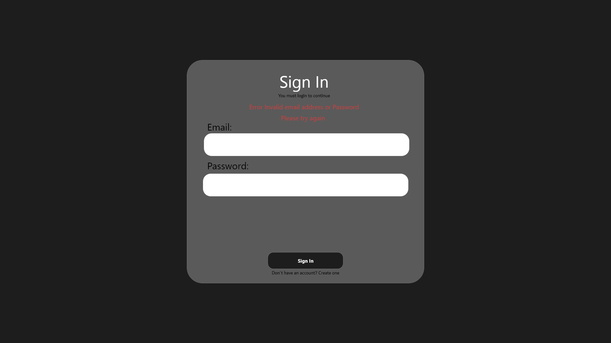
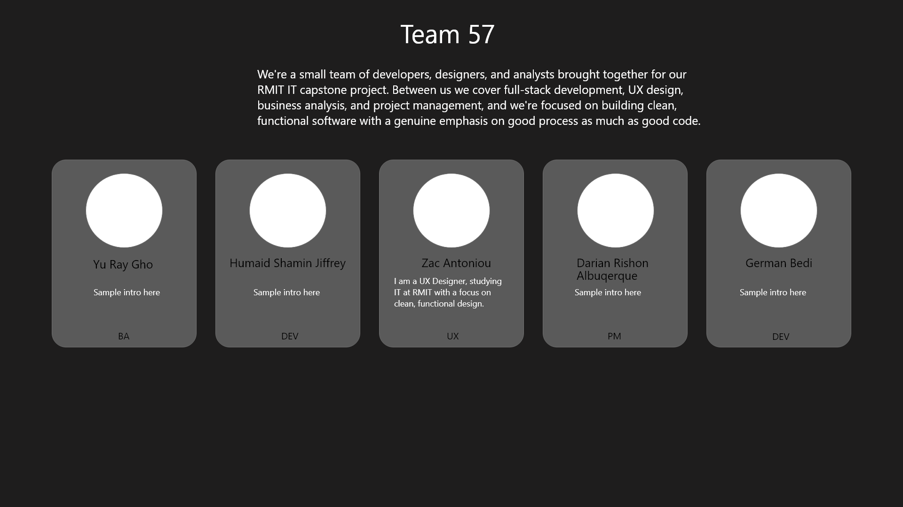
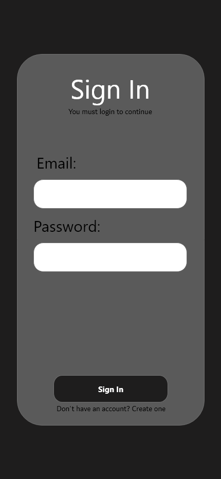
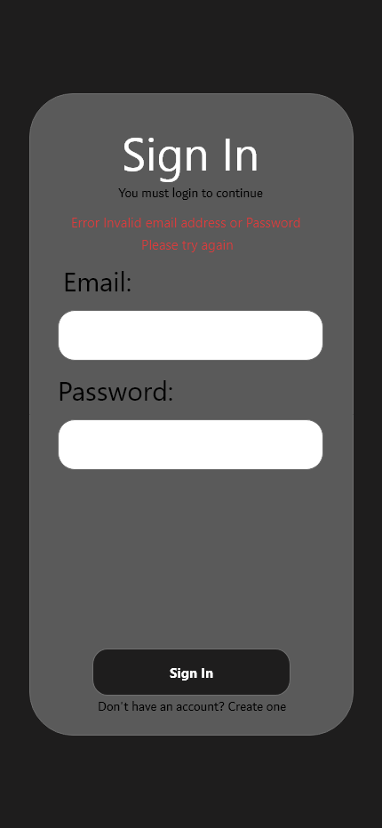
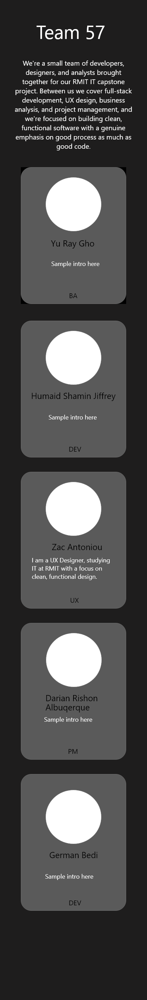

# UX Design Notes — Login & Team Page

## Colours

- Background: `#1E1D1D`
- Sign In card background: `#5A5A5A`
- Team member card background: `#5A5A5A`
- Error text: red (see error mockup)
- Input fields: white

## Typography

- Font: Segoe UI (used in mockups). If not easily available in the web stack, a similar clean sans-serif (e.g. system default / Inter) is fine, just keep it consistent across both pages.
- Team name: 55px
- Team intro: 25px (desktop) → 20px (mobile)
- Email / Password labels: 30px
- Team member names: 25px
- Job titles: 18px
- Member intro/blurb text: 18px

## Layout

- Team page: 5 cards in a row on desktop, stacked vertically on mobile
- Login page: centered card on desktop, narrower/near full-width on mobile
- Same background colour across both login and team pages for consistency

## Mockups

PNG exports (view directly below):

Mobile versions:

Source file (for exact measurements/spacing): `Team57 Draft Pages.xd`
